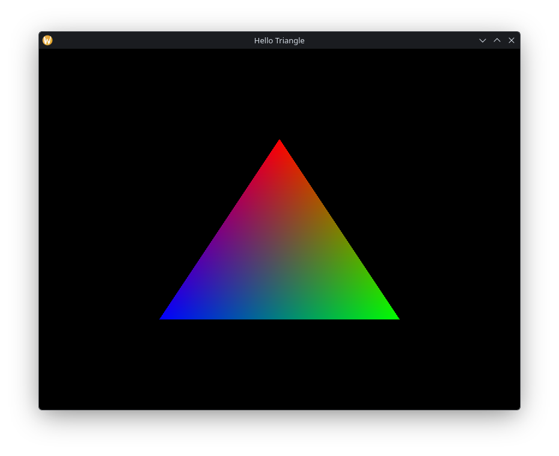

# Pyronyx Triangle

It's the Magic Triangle in pure Rust

## Overview 

This is just a example to get used to pyronyx.
You can go through this by following the [C++ Vulkan Tutorial](https://vulkan-tutorial.com/) up to chapter [Swapchain Recreation](https://vulkan-tutorial.com/Drawing_a_triangle/Swap_chain_recreation).
After replicating all the code you should be good to go with the rest of the other tutorials, knowing the pyronys system.

Here is also a different tutorial using Rust and [Ash](https://github.com/ash-rs/ash) [vulkan-tutorial-rust](https://github.com/unknownue/vulkan-tutorial-rust)

## Questions

- Why is the `cargo run --release` binary so big?

Because winit is just so unoptimized, I might make my own windowing lib.

##

## License

MIT
